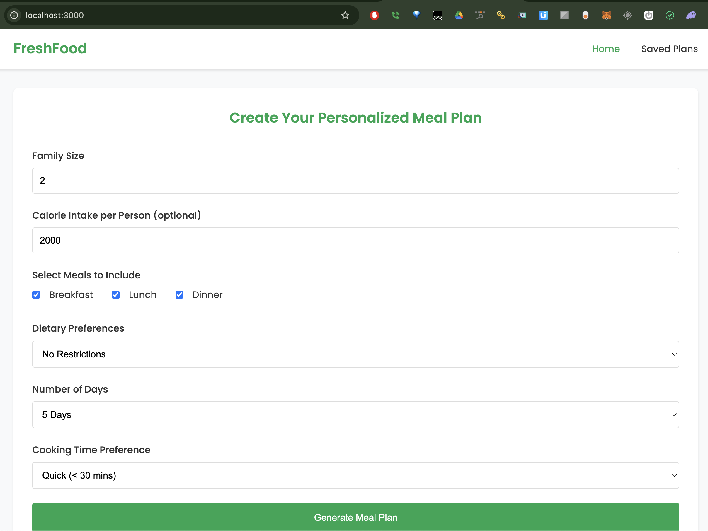
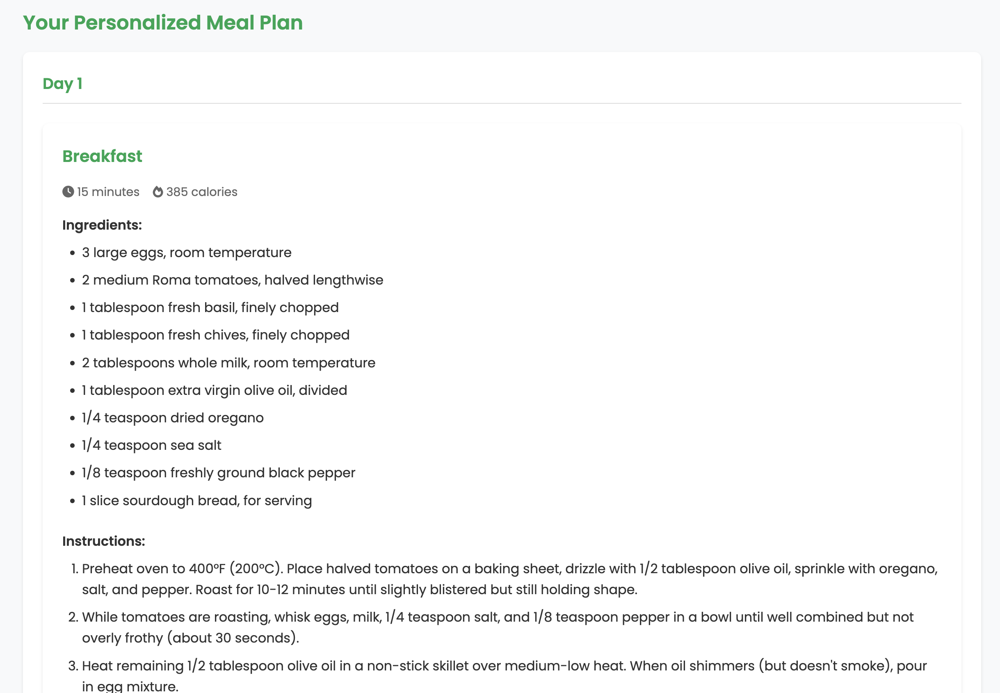
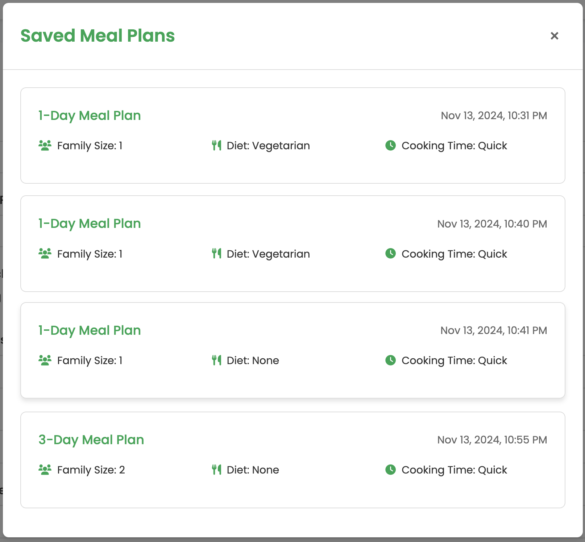
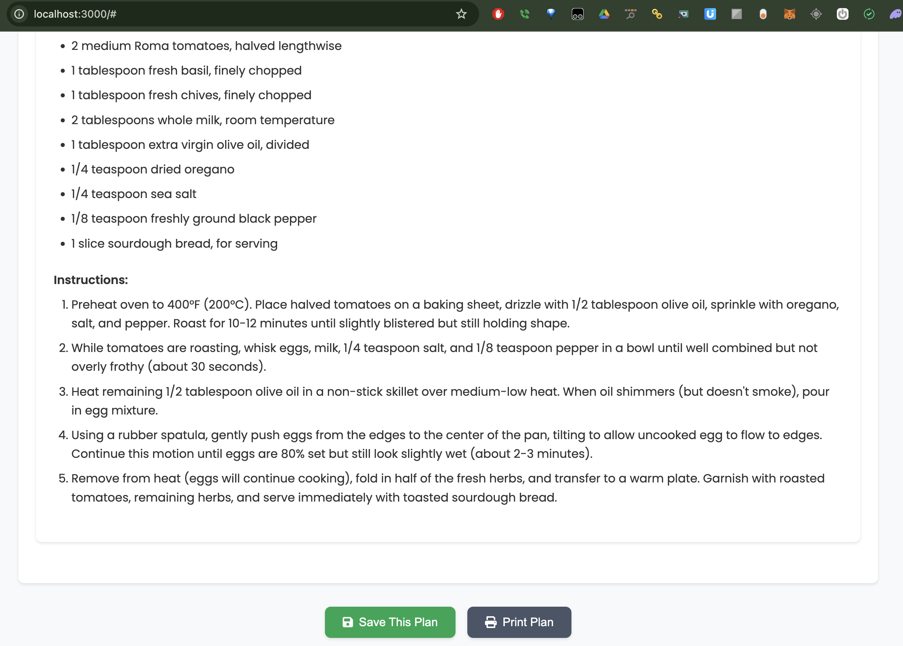
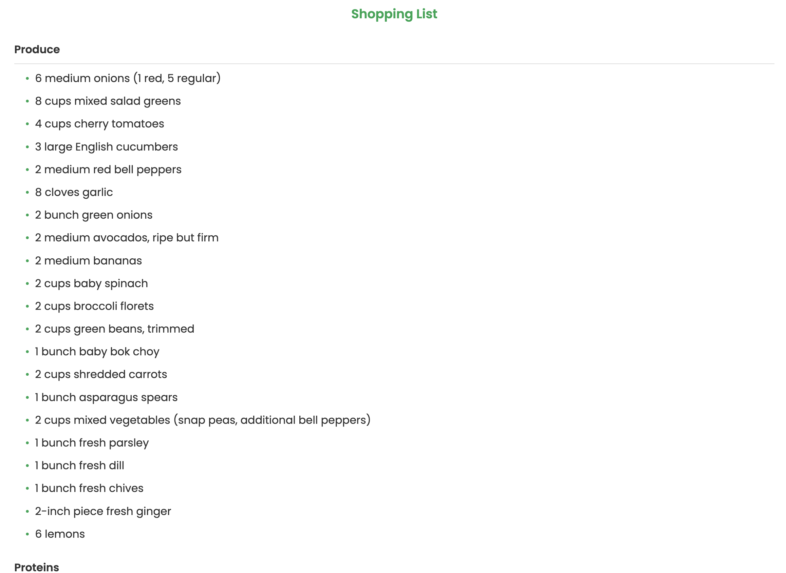

# FreshFood 🥗

[](https://opensource.org/licenses/MIT)
[](https://nodejs.org/)

A modern web application that generates personalized meal plans and grocery lists using AI technology. FreshFood helps you plan your meals efficiently while considering dietary preferences, family size, and time constraints.

## 📸 Application Screenshots

### Home Page & Meal Plan Generation

*The main interface where users can customize their meal plan preferences*

### Meal Plan Details

*Detailed view of generated meal plans with nutritional information*

### Save & Load Recepies

*Save and load recepies*

### Recipe Management

*Interface for viewing and managing individual recipes*

### Smart Grocery List

*Automatically generated grocery lists with categorized items and quantities*

## ✨ Features

- 🎯 **Personalized Meal Plans** based on:
  - Family size and portions
  - Calorie intake goals
  - Dietary restrictions (vegetarian, vegan, gluten-free, dairy-free)
  - Number of days (1-7)
  - Cooking time preferences
- 🤖 **AI-Powered Recipe Generation** using advanced LLM technology
- 🛒 **Smart Grocery Lists** with categorized items and quantities
- 💾 **Save & Share** your favorite meal plans
- 📱 **Responsive Design** that works on all devices
- 🖨️ **Print-Friendly** meal plans and shopping lists

## 🚀 Quick Start

### Prerequisites

- Node.js (v14 or higher)
- LiteLLM Proxy Server

### Installation

1. Clone the repository:
```bash
git clone https://github.com/yourusername/freshfood.git
cd freshfood
```

2. Install dependencies:
```bash
npm install
```

3. Create a `.env` file in the root directory:
```env
LITELLM_API_BASE=http://localhost:8000
LITELLM_API_KEY=your_api_key_here
PORT=3000
```

4. Launch the application:
```bash
# Development mode
npm run dev

# Production mode
npm start
```

Visit `http://localhost:3000` to access the application.

## 🏗️ Project Structure

```
freshfood/
├── data/               # Stored meal plans
├── public/             # Static files
│   ├── css/           # Stylesheets
│   ├── js/            # Frontend JavaScript
│   └── index.html     # Main HTML file
├── models/            # Data models
├── routes/            # API routes
├── server.js          # Express server setup
├── .env              # Environment variables
└── package.json      # Project dependencies
```

## 🔌 API Endpoints

| Method | Endpoint | Description |
|--------|----------|-------------|
| POST | `/api/generate-meal-plan` | Generate a new meal plan |
| POST | `/api/save-meal-plan` | Save a meal plan |
| GET | `/api/saved-meal-plans` | Retrieve saved meal plans |

## 🛠️ Technology Stack

- **Frontend**:
  - HTML5, CSS3, JavaScript (ES6+)
  - Responsive design with CSS Grid/Flexbox
  - Font Awesome icons
  - Google Fonts (Poppins)

- **Backend**:
  - Node.js & Express.js
  - File-based storage system
  - LiteLLM for AI integration
  - CORS enabled

## 🔧 Configuration

| Variable | Description | Default |
|----------|-------------|---------|
| `LITELLM_API_BASE` | LiteLLM proxy server URL | `http://localhost:8000` |
| `LITELLM_API_KEY` | LiteLLM API key | Required |
| `PORT` | Application port | 3000 |

## 💾 Data Storage

FreshFood uses a simple and efficient file-based storage system:
- Meal plans are stored as JSON files in the `data` directory
- No database setup required
- Easy to backup and migrate
- Automatic data directory creation on startup

## 🧪 Development

Start the application in development mode with hot reloading:
```bash
npm run dev
```

Run API tests:
```bash
node test-api.js
```

## 🤝 Contributing

We welcome contributions! Please follow these steps:

1. Fork the repository
2. Create a feature branch: `git checkout -b feature/NewFeature`
3. Make your changes
4. Commit with clear messages: `git commit -m 'Add NewFeature'`
5. Push to your branch: `git push origin feature/NewFeature`
6. Open a Pull Request

## 🔍 Troubleshooting

### Common Issues

1. **Permission Issues with Data Directory**
   ```bash
   # Check directory permissions
   ls -la data/
   # Set correct permissions
   chmod 755 data/
   ```

2. **LiteLLM API Issues**
   - Verify API key in `.env`
   - Ensure LiteLLM proxy server is running
   - Check server logs for detailed errors

3. **Port Already in Use**
   ```bash
   # Find and kill process using port 3000
   lsof -i :3000
   kill -9 <PID>
   ```

## 📝 License

This project is licensed under the MIT License - see the [LICENSE](LICENSE) file for details.

## 🙏 Acknowledgments

- [LiteLLM](https://github.com/BerriAI/litellm) for AI integration
- [Font Awesome](https://fontawesome.com) for icons
- [Google Fonts](https://fonts.google.com) for typography

---

Made with ❤️ by [Your Name]

*Note: Replace usernames and other placeholder content before publishing.*
